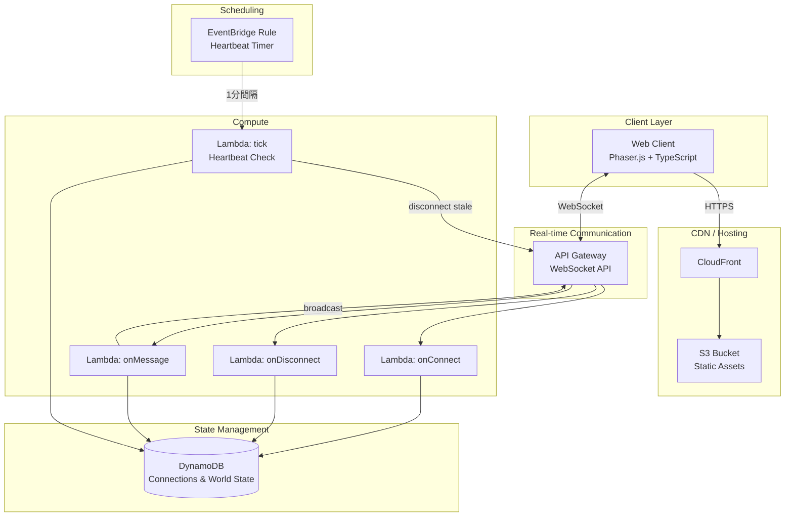
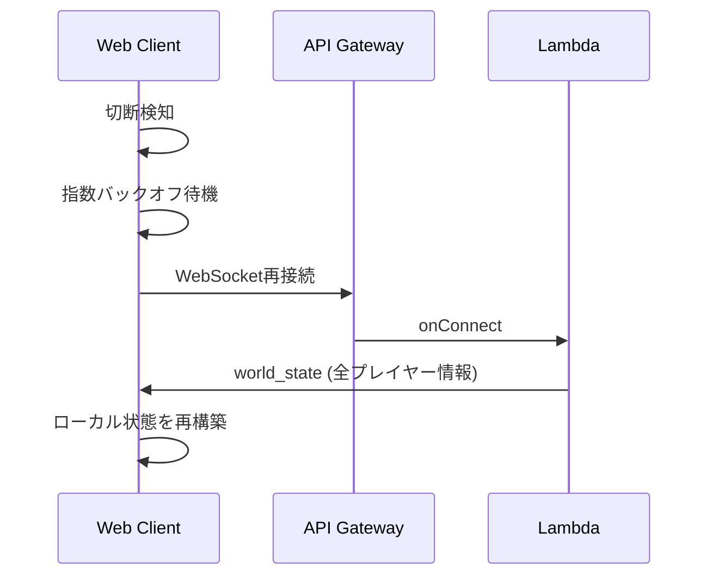

# Design Document: AWS Game Platform

## Overview

AWSを基盤とした2Dマルチプレイヤー交流空間の技術設計書。どうぶつの森のようにプレイヤーがブラウザからログイン不要で1つの共有ワールドに集まり、アバターを操作して交流できるWebアプリケーションを構築する。

本設計はコスト最優先の個人プロジェクトとして、サーバーレスアーキテクチャを採用する。プレイヤーがいない時のコストをゼロに近づけつつ、50人程度の同時接続を支える構成とする。

### 設計方針

- **サーバーレスファースト**: 固定費ゼロを目指し、使った分だけ課金されるサービスを優先
- **シンプルさ優先**: 初期フェーズでは最小限の構成で動作することを最優先
- **拡張性の確保**: 後続フェーズでゲームコンテンツを追加できる基盤設計

## Architecture

### システム構成図



### アーキテクチャ選定理由

| 選択肢 | 採用理由 |
|--------|----------|
| API Gateway WebSocket API | サーバーレスでWebSocket接続を管理。接続がない時はコストゼロ。50接続程度なら十分 |
| Lambda | イベント駆動でリクエスト単位課金。アイドル時コストゼロ |
| DynamoDB (On-Demand) | 接続情報・ワールド状態の保持。アイドル時ほぼコストゼロ。25GBまで無料枠 |
| S3 + CloudFront | 静的アセット配信の最安構成。CloudFrontの無料枠(1TB/月転送)で十分 |
| EventBridge | 定期的なハートビートチェック用。cronジョブとして最安 |

### コスト見積もり（50人同時接続・1日2時間利用を想定）

- API Gateway WebSocket: 接続分数 + メッセージ数 ≈ $0.50/月
- Lambda: リクエスト数 × 実行時間 ≈ $1.00/月
- DynamoDB: On-Demand reads/writes ≈ $0.50/月
- S3 + CloudFront: 無料枠内 ≈ $0.00/月
- **合計: 約 $2.00/月（利用がない月はほぼ $0）**

### Infrastructure as Code 方針

インフラの構築・管理には **AWS CDK (TypeScript)** を採用する。アプリケーションコードと同一言語で記述でき、型安全にインフラを定義できるメリットがある。

**基本方針:**

- CDK の L2 コンストラクト（高レベル抽象）を優先的に使用し、簡潔かつ保守しやすい定義を目指す
- L2 コンストラクトが未成熟または不十分なリソース（例: API Gateway WebSocket API）については、`CfnResource`（L1 コンストラクト）で CloudFormation テンプレートを直接記述する
- スタック構成はシンプルに保ち、単一スタックで全リソースを管理する（将来的にスタック分割を検討可能）

**CDK スタック構成（想定）:**

| リソース | 定義方法 | 理由 |
|----------|----------|------|
| DynamoDB テーブル | L2 (`aws-dynamodb.Table`) | 成熟したコンストラクトが利用可能 |
| Lambda 関数 | L2 (`aws-lambda-nodejs.NodejsFunction`) | TypeScript のバンドル含め十分なサポート |
| S3 バケット | L2 (`aws-s3.Bucket`) | 標準的なユースケース |
| CloudFront ディストリビューション | L2 (`aws-cloudfront.Distribution`) | S3 オリジン連携が簡潔 |
| API Gateway WebSocket API | L1 (`CfnApi`, `CfnRoute`, `CfnIntegration` 等) | WebSocket API の L2 コンストラクトが限定的なため CloudFormation で直接定義 |
| EventBridge ルール | L2 (`aws-events.Rule`) | 標準的なユースケース |

**開発フロー:**

```
cdk synth   → CloudFormation テンプレート生成・確認
cdk diff    → 差分確認
cdk deploy  → デプロイ
```

## Components and Interfaces

### 1. Web Client (Phaser.js)

ブラウザ上で動作する2Dゲームクライアント。

```typescript
// クライアントの主要モジュール構成
interface WebClientModules {
  GameScene: PhaserScene;        // メインゲームシーン（ワールド描画）
  NetworkManager: NetworkManager; // WebSocket通信管理
  AvatarManager: AvatarManager;  // アバター生成・描画・更新
  InputHandler: InputHandler;    // キーボード/タッチ入力処理
}
```

**技術選定:**
- **Phaser.js 3**: 2Dゲームフレームワーク。Canvas/WebGL両対応、アニメーション・入力処理の機能が充実
- **TypeScript**: 型安全性でバグを防止
- **Vite**: 高速なビルドツール

### 2. API Gateway WebSocket API

WebSocket接続のライフサイクルを管理するマネージドサービス。

**ルート定義:**

| ルート | Lambda関数 | 説明 |
|--------|-----------|------|
| `$connect` | onConnect | 接続確立時 |
| `$disconnect` | onDisconnect | 切断時 |
| `$default` | onMessage | メッセージ受信時 |

### 3. Lambda Functions

#### onConnect

```typescript
// 新規プレイヤーの接続処理
async function handler(event: APIGatewayProxyWebSocketEvent) {
  const connectionId = event.requestContext.connectionId;
  const sessionId = generateUUID();
  const avatar = generateRandomAvatar();
  const spawnPosition = getRandomSpawnPosition();

  // DynamoDBにセッション登録
  await saveConnection({ connectionId, sessionId, avatar, position: spawnPosition, lastSeen: Date.now() });

  // 既存プレイヤーに新規参加を通知
  await broadcastToAll({ type: 'player_joined', sessionId, avatar, position: spawnPosition });

  // 新規プレイヤーに現在のワールド状態を送信
  await sendToConnection(connectionId, { type: 'world_state', players: await getAllPlayers() });
}
```

#### onDisconnect

```typescript
// プレイヤーの切断処理
async function handler(event: APIGatewayProxyWebSocketEvent) {
  const connectionId = event.requestContext.connectionId;
  const player = await getPlayerByConnectionId(connectionId);

  // セッション削除
  await deleteConnection(connectionId);

  // 他プレイヤーに離脱通知
  await broadcastToAll({ type: 'player_left', sessionId: player.sessionId });
}
```

#### onMessage

```typescript
// メッセージルーティング
async function handler(event: APIGatewayProxyWebSocketEvent) {
  const connectionId = event.requestContext.connectionId;
  const body = JSON.parse(event.body);

  switch (body.action) {
    case 'move':
      await handleMove(connectionId, body.position);
      break;
    case 'customize_avatar':
      await handleCustomizeAvatar(connectionId, body.avatarData);
      break;
    case 'heartbeat':
      await updateLastSeen(connectionId);
      break;
  }
}

async function handleMove(connectionId: string, position: Position) {
  // 位置情報バリデーション
  if (!isValidPosition(position)) return;

  // DynamoDB更新
  await updatePlayerPosition(connectionId, position);

  // 他プレイヤーにブロードキャスト
  const player = await getPlayerByConnectionId(connectionId);
  await broadcastToOthers(connectionId, {
    type: 'player_moved',
    sessionId: player.sessionId,
    position
  });
}
```

#### tick (Heartbeat Check)

```typescript
// EventBridgeから1分間隔で起動
async function handler() {
  const now = Date.now();
  const staleThreshold = 60_000; // 60秒

  const allConnections = await getAllConnections();
  const staleConnections = allConnections.filter(
    conn => now - conn.lastSeen > staleThreshold
  );

  for (const conn of staleConnections) {
    // API Gateway経由で切断
    await disconnectClient(conn.connectionId);
    await deleteConnection(conn.connectionId);
    await broadcastToAll({ type: 'player_left', sessionId: conn.sessionId });
  }
}
```

### 4. DynamoDB テーブル設計

**Connections テーブル:**

| 属性 | 型 | 説明 |
|------|------|------|
| connectionId (PK) | String | API GatewayのconnectionId |
| sessionId | String | 一意のセッション識別子 |
| avatar | Map | アバター外見データ |
| position | Map | `{ x: number, y: number }` |
| lastSeen | Number | 最終通信のUnixタイムスタンプ |

### 5. 通信プロトコル

#### クライアント → サーバー メッセージ

```typescript
// 移動
{ action: 'move', position: { x: number, y: number } }

// アバターカスタマイズ
{ action: 'customize_avatar', avatarData: AvatarData }

// ハートビート
{ action: 'heartbeat' }
```

#### サーバー → クライアント メッセージ

```typescript
// ワールド状態（参加時に受信）
{ type: 'world_state', players: PlayerInfo[] }

// プレイヤー参加
{ type: 'player_joined', sessionId: string, avatar: AvatarData, position: Position }

// プレイヤー離脱
{ type: 'player_left', sessionId: string }

// プレイヤー移動
{ type: 'player_moved', sessionId: string, position: Position }

// アバター更新
{ type: 'avatar_updated', sessionId: string, avatarData: AvatarData }
```

## Data Models

### Position

```typescript
interface Position {
  x: number; // ワールド座標 (0 ~ WORLD_WIDTH)
  y: number; // ワールド座標 (0 ~ WORLD_HEIGHT)
}
```

### AvatarData

```typescript
interface AvatarData {
  bodyColor: string;    // 体の色 (事前定義の選択肢から)
  headShape: string;    // 頭の形
  accessory: string;    // アクセサリー (帽子、メガネなど)
}
```

### PlayerInfo

```typescript
interface PlayerInfo {
  sessionId: string;
  avatar: AvatarData;
  position: Position;
}
```

### ConnectionRecord (DynamoDB)

```typescript
interface ConnectionRecord {
  connectionId: string;  // PK
  sessionId: string;
  avatar: AvatarData;
  position: Position;
  lastSeen: number;      // Unix timestamp (ms)
}
```

### WebSocket メッセージ型

```typescript
// クライアント → サーバー
type ClientMessage =
  | { action: 'move'; position: Position }
  | { action: 'customize_avatar'; avatarData: AvatarData }
  | { action: 'heartbeat' };

// サーバー → クライアント
type ServerMessage =
  | { type: 'world_state'; players: PlayerInfo[] }
  | { type: 'player_joined'; sessionId: string; avatar: AvatarData; position: Position }
  | { type: 'player_left'; sessionId: string }
  | { type: 'player_moved'; sessionId: string; position: Position }
  | { type: 'avatar_updated'; sessionId: string; avatarData: AvatarData };
```

### ワールド定数

```typescript
const WORLD_WIDTH = 1600;   // ワールド幅 (px)
const WORLD_HEIGHT = 1200;  // ワールド高さ (px)
const MAX_PLAYERS = 50;
const HEARTBEAT_INTERVAL = 30_000;  // クライアントの送信間隔 (30秒)
const STALE_THRESHOLD = 60_000;     // タイムアウト閾値 (60秒)
const POSITION_SYNC_RATE = 100;     // 位置送信間隔 (ms) - クライアント側スロットリング
```

## Correctness Properties

*プロパティとは、システムの有効な実行すべてにおいて成り立つべき特性や振る舞いのことであり、人間が読める仕様と機械が検証可能な正確性保証をつなぐ橋渡しとなるものです。*

### Property 1: セッション識別子の一意性

*For any* 複数の Player が同時にまたは順次 Shared_World に参加した場合、Game_Server が各 Player に割り当てる Session 識別子はすべて互いに異なる

**Validates: Requirements 1.2**

### Property 2: アバター生成の有効性

*For any* Player が Shared_World に参加しアバターが生成された場合、生成されたアバターの各属性（bodyColor, headShape, accessory）は事前定義された有効な選択肢セットに含まれる

**Validates: Requirements 1.3**

### Property 3: メッセージシリアライズのラウンドトリップ

*For any* 有効な ClientMessage または ServerMessage について、シリアライズしてからデシリアライズした結果は元のメッセージと同一である

**Validates: Requirements 2.2**

### Property 4: 位置ブロードキャストのデータ整合性

*For any* 有効な位置更新メッセージをサーバーが受信した場合、送信者以外の全接続 Player にブロードキャストされる player_moved メッセージ内の position は、元のメッセージの position と同一である

**Validates: Requirements 2.3, 3.1**

### Property 5: ワールド状態の完全性

*For any* Player が Shared_World に新規参加した場合、受信する world_state メッセージに含まれるプレイヤーリストは、その時点で Connections テーブルに存在するすべてのアクティブな Player を含み、かつ存在しない Player を含まない

**Validates: Requirements 3.2**

### Property 6: セッション終了時のクリーンアップ完全性

*For any* Session が終了した場合（明示的切断またはタイムアウト）、Connections テーブルからその Player のレコードが完全に削除され、残りの全接続 Player に player_left メッセージが送信され、以降そのプレイヤーのデータはシステム内に存在しない

**Validates: Requirements 3.3, 5.1, 5.2, 5.3**

### Property 7: タイムアウト判定の正確性

*For any* lastSeen タイムスタンプと現在時刻の組み合わせについて、その差が 60 秒を超える Player のみがタイムアウトと判定され Session が終了される。60 秒以内の Player は影響を受けない

**Validates: Requirements 3.4**

### Property 8: アバターカスタマイズのラウンドトリップ

*For any* 有効な AvatarData を Player がカスタマイズとして送信した場合、Game_Server はそのデータを保持し、他の全接続 Player にブロードキャストされる avatar_updated メッセージ内の avatarData は送信されたデータと同一である

**Validates: Requirements 4.2, 4.3**

## Error Handling

### クライアント側

| エラー種別 | 対処方針 |
|-----------|----------|
| WebSocket接続失敗 | 指数バックオフで再接続を試行（最大5回）。ユーザーに接続状況を表示 |
| WebSocket切断 | 自動再接続を試行。再接続時にworld_stateを再取得 |
| 不正なサーバーメッセージ | JSONパースエラーをキャッチし、無視してログ出力 |
| 位置同期の遅延 | クライアント側予測（補間）で視覚的なラグを軽減 |

### サーバー側

| エラー種別 | 対処方針 |
|-----------|----------|
| 不正なクライアントメッセージ | バリデーション失敗時は無視。DDoS防止のためレート制限を検討 |
| DynamoDB書き込み失敗 | リトライ（SDK組み込みのリトライ）。それでも失敗時はエラーログ |
| ブロードキャスト失敗（stale接続） | GoneException（410）をキャッチし、その接続をクリーンアップ |
| Lambda実行タイムアウト | 29秒のAPI Gateway制限内で処理完了を保証。ブロードキャストは非同期並列実行 |

### 再接続フロー



## Testing Strategy

### テストレベル

#### 1. 単体テスト（Example-Based）

具体的な入出力例でロジックを検証する。PBTで広範な入力をカバーするため、単体テストはエッジケースと統合ポイントに集中する。

- **Lambda関数のビジネスロジック**: 不正メッセージの拒否、ワールド範囲外座標の処理、空のconnectionリストでのブロードキャスト
- **クライアントのNetworkManager**: 再接続ロジック、接続状態管理
- **AvatarManager**: 不正なカスタマイズデータの拒否

#### 2. Property-Based Tests（プロパティベーステスト）

本プロジェクトのコアロジック（純粋関数・状態遷移）にPBTを適用する。

**ライブラリ**: [fast-check](https://github.com/dubzzz/fast-check)（TypeScript向けPBTライブラリ）

**設定:**
- 最低100イテレーション/テスト
- 各テストにデザインドキュメントのPropertyへの参照タグを付与
- タグ形式: `Feature: aws-game-platform, Property {number}: {property_text}`
- 各Correctness Propertyを1つのプロパティベーステストで実装

**対象プロパティ:**

| Property | テスト対象 | パターン |
|----------|-----------|---------|
| Property 1: セッション識別子の一意性 | セッションID生成関数 | 不変条件 |
| Property 2: アバター生成の有効性 | アバター生成関数 | 不変条件 |
| Property 3: メッセージシリアライズのラウンドトリップ | メッセージ型のserialize/parse | ラウンドトリップ |
| Property 4: 位置ブロードキャストのデータ整合性 | handleMove関数 | 不変条件 |
| Property 5: ワールド状態の完全性 | onConnect のworld_state構築 | 不変条件 |
| Property 6: セッション終了のクリーンアップ | onDisconnect / tick 関数 | 不変条件 |
| Property 7: タイムアウト判定の正確性 | tick Lambda の判定ロジック | 不変条件 |
| Property 8: アバターカスタマイズのラウンドトリップ | handleCustomizeAvatar関数 | ラウンドトリップ |

#### 3. 統合テスト

AWSサービスとの実際の連携を少数の代表例で検証する。

- **WebSocket接続ライフサイクル**: 接続→メッセージ送受信→切断の一連フロー（1-2シナリオ）
- **DynamoDB操作**: 実際のテーブルに対するCRUD操作（各操作1-2例）
- **ブロードキャスト配信**: 複数接続へのメッセージ配信確認（2-3接続）
- **タイムアウト**: ハートビート停止後のセッション終了確認（1シナリオ）

#### 4. E2Eテスト

- **マルチプレイヤーシナリオ**: 複数ブラウザからの同時接続・移動・離脱
- **クロスブラウザ**: Chrome, Firefox, Safari での動作確認

### テスト環境

- **ローカル開発**: `aws-sdk-mock` でAWSサービスをモック。PBTと単体テストはモック環境で実行
- **CI**: GitHub Actions でユニットテスト + PBTを自動実行
- **ステージング**: 実際のAWS環境（別スタック）で統合テスト・E2Eテスト

### テストフレームワーク

- **ランタイム**: Node.js + TypeScript
- **テストランナー**: Vitest
- **PBT**: fast-check
- **E2E**: Playwright（ブラウザ操作） + ws（WebSocketクライアント）
