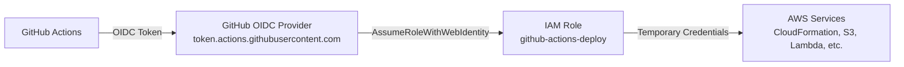

# Design Document: CI/CD Pipeline

## Overview

GitHub Actionsを用いたCI/CDパイプラインの技術設計。モノレポ構成（npm workspaces）のプロジェクトに対し、PR検証（CI）とmainブランチマージ後の段階的デプロイ（CD）を実現する。AWS認証にはGitHub OIDCを採用し、長期シークレットキーの管理を不要にする。同一のCDKスタック（`GamePlatformStack`）をcontextパラメータで切り替え、dev/prodの2環境に独立デプロイする。個人プロジェクトのためGitHub-hosted runnersを利用しコストを最小化する。

## Architecture

### ワークフロー全体構成

```mermaid
flowchart TD
    subgraph "CI: Pull Request"
        PR[PR opened/updated] --> CI_Install[npm ci + cache]
        CI_Install --> CI_Test[npm run test]
        CI_Install --> CI_Build[npm run build]
        CI_Test --> CI_Result{Pass?}
        CI_Build --> CI_Result
        CI_Result -->|Yes| PR_Ready[PR Ready to Merge]
        CI_Result -->|No| PR_Block[PR Blocked]
    end

    subgraph "CD: Deploy"
        Push[Push to main] --> CD_Install[npm ci + cache]
        CD_Install --> CD_Build_Dev[Build client<br/>VITE_WEBSOCKET_URL=dev]
        CD_Build_Dev --> CD_Deploy_Dev[cdk deploy<br/>-c env=dev]
        CD_Deploy_Dev --> CD_Result_Dev{Success?}
        CD_Result_Dev -->|No| CD_Fail[Pipeline Halt]
        CD_Result_Dev -->|Yes| CD_Approval[Manual Approval<br/>timeout: 72h]
        CD_Approval -->|Approved| CD_Build_Prod[Build client<br/>VITE_WEBSOCKET_URL=prod]
        CD_Build_Prod --> CD_Deploy_Prod[cdk deploy<br/>-c env=prod]
        CD_Approval -->|Timeout/Rejected| CD_Cancel[Cancel]
    end

    subgraph "AWS Authentication"
        GH_OIDC[GitHub OIDC Token] --> STS[AWS STS<br/>AssumeRoleWithWebIdentity]
        STS --> TempCreds[Temporary Credentials]
        TempCreds --> CDK_Deploy[CDK Deploy]
    end
```



### ファイル構成

```
.github/
├── workflows/
│   ├── ci.yml          # CI: テスト・ビルド検証
│   └── cd.yml          # CD: dev/prodデプロイ
```

## Components and Interfaces

### 1. CI Workflow（`.github/workflows/ci.yml`）

PRイベントをトリガーとし、テストとビルドの検証を行う。

```yaml
name: CI

on:
  pull_request:
    branches: [main]

jobs:
  test-and-build:
    runs-on: ubuntu-latest
    steps:
      - uses: actions/checkout@v4

      - uses: actions/setup-node@v4
        with:
          node-version: '20'
          cache: 'npm'

      - run: npm ci

      - run: npm run build

      - run: npm run test
```

**設計ポイント**:
- `ubuntu-latest`（GitHub-hosted runner）を使用しインフラ維持コストゼロ
- `actions/setup-node@v4` の `cache: 'npm'` でnpm依存をキャッシュし実行時間短縮
- `npm ci` で再現可能なビルドを保証
- buildを先に実行（shared→server/client/cdkの依存ビルド順序のため）
- Node.js 20を指定（engines >= 18要件を満たす最新LTS）

### 2. CD Workflow（`.github/workflows/cd.yml`）

mainブランチへのpushをトリガーとし、dev→prodの順でデプロイする。

```yaml
name: CD

on:
  push:
    branches: [main]

permissions:
  id-token: write   # OIDC token取得に必要
  contents: read

jobs:
  deploy-dev:
    runs-on: ubuntu-latest
    environment: dev
    steps:
      - uses: actions/checkout@v4

      - uses: actions/setup-node@v4
        with:
          node-version: '20'
          cache: 'npm'

      - run: npm ci

      - run: npm run build
        env:
          VITE_WEBSOCKET_URL: ${{ vars.VITE_WEBSOCKET_URL }}

      - uses: aws-actions/configure-aws-credentials@v4
        with:
          role-to-assume: ${{ secrets.AWS_ROLE_ARN }}
          aws-region: ap-northeast-1

      - run: npx cdk deploy --require-approval never -c env=dev
        working-directory: packages/cdk

  deploy-prod:
    needs: deploy-dev
    runs-on: ubuntu-latest
    environment: prod  # GitHub Environmentの手動承認を利用
    steps:
      - uses: actions/checkout@v4

      - uses: actions/setup-node@v4
        with:
          node-version: '20'
          cache: 'npm'

      - run: npm ci

      - run: npm run build
        env:
          VITE_WEBSOCKET_URL: ${{ vars.VITE_WEBSOCKET_URL }}

      - uses: aws-actions/configure-aws-credentials@v4
        with:
          role-to-assume: ${{ secrets.AWS_ROLE_ARN }}
          aws-region: ap-northeast-1

      - run: npx cdk deploy --require-approval never -c env=prod
        working-directory: packages/cdk
```

**設計ポイント**:
- `environment: prod` でGitHub Environmentsの保護ルール（Required reviewers）を利用し手動承認を実現
- 承認タイムアウトはGitHub Environment設定で72時間に設定
- `needs: deploy-dev` でdev成功後のみprodジョブが実行される
- 各環境ごとにクライアントをリビルド（`VITE_WEBSOCKET_URL`が環境固有のため）
- シーケンシャル実行により並列デプロイを回避

### 3. CDKスタック環境分離

既存の`GamePlatformStack`を修正し、contextパラメータ（`-c env=dev|prod`）でリソース名を切り替える。

**app.ts の変更**:

```typescript
#!/usr/bin/env node
import "source-map-support/register";
import * as cdk from "aws-cdk-lib";
import { GamePlatformStack } from "../lib/game-platform-stack";

const app = new cdk.App();
const envName = app.node.tryGetContext("env") || "dev";

new GamePlatformStack(app, `GamePlatform-${envName}`, {
  description: `AWS Game Platform - ${envName} environment`,
  env: {
    account: process.env.CDK_DEFAULT_ACCOUNT,
    region: process.env.CDK_DEFAULT_REGION || "ap-northeast-1",
  },
});
```

**スタック名の変更**:
- dev: `GamePlatform-dev`
- prod: `GamePlatform-prod`

これにより同一AWSアカウント内で2つの独立したCloudFormationスタックとしてデプロイされる。リソース名の衝突はCDKの自動生成サフィックスで回避される（スタック名が異なるため論理IDも異なる）。

### 4. OIDC認証基盤

GitHub OIDCプロバイダーとIAMロールをCDKで定義する（または手動作成）。

**IAM構成概要**:



**信頼ポリシー（Trust Policy）**:

```json
{
  "Version": "2012-10-17",
  "Statement": [
    {
      "Effect": "Allow",
      "Principal": {
        "Federated": "arn:aws:iam::<ACCOUNT_ID>:oidc-provider/token.actions.githubusercontent.com"
      },
      "Action": "sts:AssumeRoleWithWebIdentity",
      "Condition": {
        "StringEquals": {
          "token.actions.githubusercontent.com:aud": "sts.amazonaws.com"
        },
        "StringLike": {
          "token.actions.githubusercontent.com:sub": "repo:m-kotaro/game-plaza-proto:ref:refs/heads/main"
        }
      }
    }
  ]
}
```

**信頼ポリシーのポイント**:
- `sub` 条件でリポジトリとmainブランチのみに制限
- PR（`pull_request`イベント）からはOIDCでのAssumeRoleが不可能（CIではAWS認証不要）

**IAMロールのPermissions Policy**:

CDKデプロイに必要な最小権限を付与。CDKはCloudFormationを経由するため、以下の権限が必要:

```json
{
  "Version": "2012-10-17",
  "Statement": [
    {
      "Effect": "Allow",
      "Action": [
        "cloudformation:*",
        "s3:*",
        "lambda:*",
        "apigateway:*",
        "dynamodb:*",
        "iam:*",
        "cloudfront:*",
        "events:*",
        "logs:*",
        "ssm:GetParameter",
        "sts:AssumeRole"
      ],
      "Resource": "*"
    }
  ]
}
```

> **注意**: 個人プロジェクトのためAdministratorAccessに近い広い権限を付与している。本番プロジェクトではリソースレベルの制限を推奨。CDKが利用するcfn-exec roleのAssumeRoleも含める。

### 5. 環境変数・シークレット管理

| 種別 | キー | 格納場所 | 用途 |
|------|------|----------|------|
| Secret | `AWS_ROLE_ARN` | GitHub Secrets（環境レベル） | OIDCで引き受けるIAMロールのARN |
| Variable | `VITE_WEBSOCKET_URL` | GitHub Variables（環境レベル） | クライアントビルド時のWebSocket接続先 |

**GitHub Environments設定**:

| 環境名 | 保護ルール | Variables | Secrets |
|--------|-----------|-----------|---------|
| `dev` | なし | `VITE_WEBSOCKET_URL`=`wss://xxx.execute-api.ap-northeast-1.amazonaws.com/prod` | `AWS_ROLE_ARN` |
| `prod` | Required reviewers (1人), Wait timer: なし | `VITE_WEBSOCKET_URL`=`wss://yyy.execute-api.ap-northeast-1.amazonaws.com/prod` | `AWS_ROLE_ARN` |

**注意**: dev/prodで同じIAMロールを共有可能（同一AWSアカウントの場合）。異なるアカウントを使う場合は別ロールを設定する。

## Data Models

本機能は主にワークフロー設定ファイル（YAML）とインフラ設定（CDK TypeScript）で構成されるため、永続化されるデータモデルは存在しない。

**CDK Context パラメータ**:

```typescript
interface EnvironmentConfig {
  envName: "dev" | "prod";       // スタック名のサフィックス
  stackId: string;                // CloudFormation スタック識別子
}
```

**GitHub Actions で使用する変数の型定義（概念）**:

```typescript
interface WorkflowSecrets {
  AWS_ROLE_ARN: string;           // arn:aws:iam::123456789012:role/github-actions-deploy
}

interface WorkflowVariables {
  VITE_WEBSOCKET_URL: string;     // wss://xxx.execute-api.region.amazonaws.com/prod
}
```

## Error Handling

### CI Workflow

| エラー種別 | 対処 | 結果 |
|-----------|------|------|
| npm ci 失敗（lockfile不整合） | ジョブ失敗、ログに詳細出力 | PR merge blocked |
| テスト失敗 | テスト結果サマリーをログ出力 | PR merge blocked |
| ビルド失敗 | TypeScriptコンパイルエラーをログ出力 | PR merge blocked |
| キャッシュ取得失敗 | フォールバックで通常install続行 | 実行時間増加のみ |

### CD Workflow

| エラー種別 | 対処 | 結果 |
|-----------|------|------|
| OIDC認証失敗 | ジョブ失敗、エラーメッセージ出力 | デプロイ中止 |
| dev deploy失敗 | ジョブ失敗、CDKエラー出力 | prodへ進行しない（`needs`依存） |
| prod承認タイムアウト | GitHub Environmentsが自動キャンセル | デプロイされない |
| prod deploy失敗 | ジョブ失敗、CDKエラー出力 | CloudFormationロールバック |
| CloudFormationロールバック | CDKが失敗をレポート | 前回の安定状態を維持 |

## Testing Strategy

### テストアプローチ

本機能はInfrastructure as Code（IaCワークフロー設定）であるため、Property-Based Testingは適用しない。代わりに以下の戦略でテストする。

**1. ワークフロー構文検証**:
- `actionlint`によるGitHub Actions YAMLの静的解析
- ローカルで実行可能: `actionlint .github/workflows/*.yml`

**2. CDK Snapshot Tests**:
- 既存のVitest環境を活用し、CDKスタックのスナップショットテストを実施
- 環境分離（dev/prod）で正しくスタック名が変わることを検証

```typescript
// packages/cdk/test/environment.test.ts
import { App } from "aws-cdk-lib";
import { Template } from "aws-cdk-lib/assertions";
import { GamePlatformStack } from "../src/lib/game-platform-stack";

test("dev stack has correct name", () => {
  const app = new App({ context: { env: "dev" } });
  const stack = new GamePlatformStack(app, "GamePlatform-dev");
  const template = Template.fromStack(stack);
  // スナップショットまたは個別assertion
  expect(template.toJSON()).toMatchSnapshot();
});
```

**3. 手動統合テスト（初回セットアップ時）**:
- OIDCプロバイダー作成後、GitHub Actionsから`sts:AssumeRoleWithWebIdentity`が成功するか確認
- dev環境デプロイが正常完了するか確認
- prod環境の手動承認フローが期待通り動作するか確認

**4. テスト不要な項目**:
- GitHub Actions自体の動作（GitHub提供のインフラ）
- `actions/checkout`, `actions/setup-node`等のサードパーティアクションの内部動作
- AWS OIDC認証のプロトコル動作（AWS側の責務）
