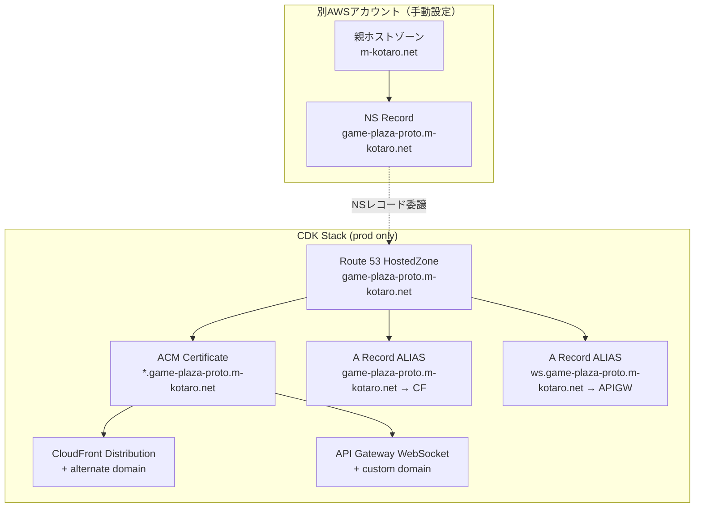

# Design Document: Custom Domain

## Overview

既存のGamePlatformStackにカスタムドメイン機能を追加する。CDK contextの`env`値に基づき、`prod`環境の場合のみRoute 53ホストゾーン、ACM証明書、カスタムドメイン設定を作成する。`dev`環境では既存のデフォルトドメイン（CloudFront配布ドメイン、API Gatewayデフォルトエンドポイント）をそのまま使用する。

ドメイン構成:
- フロントエンド: `game-plaza-proto.m-kotaro.net` → CloudFront
- WebSocket: `ws.game-plaza-proto.m-kotaro.net` → API Gateway WebSocket API

## Architecture



## Components and Interfaces

### 環境分岐ロジック

`app.ts`で取得している`envName` contextを`GamePlatformStack`のコンストラクタに渡し、スタック内部で条件分岐する。

```typescript
// app.ts から envName を props 経由で渡す
interface GamePlatformStackProps extends cdk.StackProps {
  envName: string;
}

// スタック内で条件分岐
const isProd = props.envName === "prod";
if (isProd) {
  // カスタムドメインリソースを作成
}
```

### Route 53 HostedZone

```typescript
const hostedZone = new route53.HostedZone(this, "SubdomainHostedZone", {
  zoneName: "game-plaza-proto.m-kotaro.net",
});
```

### ACM Certificate

CloudFrontがus-east-1のACM証明書を要求するため、`DnsValidatedCertificate`ではなく`Certificate`を使用し、リージョンを`us-east-1`に指定する。ただしCDKの`Certificate`コンストラクトはスタックと同じリージョンに作成されるため、CloudFront用にはcross-region参照が必要。

**対応方針**: CloudFront用の証明書は`us-east-1`に作成する必要がある。CDKの`DnsValidatedCertificate`（deprecated）の代わりに、`Certificate`コンストラクトを`us-east-1`リージョンで作成するためにcross-region referencesまたは`CrossRegionCertificate`パターンを使用する。

実際のアプローチ:
- CDKの`Certificate`コンストラクトに`region`プロパティはないため、`aws-cdk-lib/aws-certificatemanager`の`Certificate`をそのまま使い、CloudFrontの`ViewerCertificate`設定時にCDKが自動的にcross-region対応を行う（CDK v2ではCloudFront用の証明書作成時に`crossRegionReferences`スタックプロパティを有効にすることで対応）。

ただし、よりシンプルなアプローチとして:
- **スタックリージョンが`ap-northeast-1`の場合**: CloudFrontは`us-east-1`の証明書が必要。CDKの`Distribution`コンストラクトでは`certificate`プロパティに渡す証明書は`us-east-1`にある必要がある。
- **解決策**: `crossRegionReferences: true`をスタックプロパティに追加し、CDKにcross-region参照を自動処理させる。もしくは、スタックを`us-east-1`に置くか、別スタックで証明書を管理する。

**最終方針**: スタックは`ap-northeast-1`のまま、`crossRegionReferences: true`を有効にし、`us-east-1`に証明書を作成するためにCDKのcross-region機能を利用する。ただしこのアプローチは複雑なので、**よりシンプルにDnsValidatedCertificate（非推奨だが動作する）を使用**する。

```typescript
import * as acm from "aws-cdk-lib/aws-certificatemanager";

// us-east-1にCloudFront用証明書を作成（DnsValidatedCertificateを使用）
const certificate = new acm.DnsValidatedCertificate(this, "Certificate", {
  domainName: "game-plaza-proto.m-kotaro.net",
  subjectAlternativeNames: ["*.game-plaza-proto.m-kotaro.net"],
  hostedZone: hostedZone,
  region: "us-east-1", // CloudFrontはus-east-1の証明書が必要
});
```

注: `DnsValidatedCertificate`はdeprecatedだが、cross-regionの証明書作成において最もシンプルなアプローチであり、CDKが代替を提供するまで使用する。

### CloudFront カスタムドメイン設定

既存の`Distribution`コンストラクトに`domainNames`と`certificate`を追加する。

```typescript
// 既存のDistribution作成を修正
this.distribution = new cloudfront.Distribution(this, "Distribution", {
  defaultBehavior: {
    origin: origins.S3BucketOrigin.withOriginAccessControl(this.assetsBucket),
    viewerProtocolPolicy: cloudfront.ViewerProtocolPolicy.REDIRECT_TO_HTTPS,
  },
  defaultRootObject: "index.html",
  // prod環境のみ追加
  ...(isProd && {
    domainNames: ["game-plaza-proto.m-kotaro.net"],
    certificate: certificate,
  }),
});
```

### API Gateway WebSocket カスタムドメイン設定

API Gateway V2のカスタムドメインはCfnリソースで設定する。

```typescript
// API Gatewayカスタムドメイン
const wsDomainName = new apigwv2.CfnDomainName(this, "WsDomainName", {
  domainName: "ws.game-plaza-proto.m-kotaro.net",
  domainNameConfigurations: [
    {
      certificateArn: certificate.certificateArn,
      endpointType: "REGIONAL",
    },
  ],
});

// APIマッピング
new apigwv2.CfnApiMapping(this, "WsApiMapping", {
  apiId: this.webSocketApi.ref,
  domainName: wsDomainName.ref,
  stage: this.webSocketStage.ref,
});
```

### Route 53 Aレコード（ALIAS）

```typescript
import * as route53 from "aws-cdk-lib/aws-route53";
import * as route53Targets from "aws-cdk-lib/aws-route53-targets";

// CloudFront用Aレコード
new route53.ARecord(this, "CloudFrontARecord", {
  zone: hostedZone,
  recordName: "game-plaza-proto.m-kotaro.net",
  target: route53.RecordTarget.fromAlias(
    new route53Targets.CloudFrontTarget(this.distribution)
  ),
});

// API Gateway WebSocket用Aレコード
new route53.ARecord(this, "WebSocketARecord", {
  zone: hostedZone,
  recordName: "ws.game-plaza-proto.m-kotaro.net",
  target: route53.RecordTarget.fromAlias(
    new route53Targets.ApiGatewayv2DomainProperties(
      wsDomainName.attrRegionalDomainName,
      wsDomainName.attrRegionalHostedZoneId
    )
  ),
});
```

### CfnOutput

```typescript
new cdk.CfnOutput(this, "HostedZoneNameServers", {
  value: cdk.Fn.join(",", hostedZone.hostedZoneNameServers!),
  description: "NSレコード値。親ホストゾーン(m-kotaro.net)に手動追加が必要",
});

new cdk.CfnOutput(this, "CustomDomainFrontend", {
  value: "https://game-plaza-proto.m-kotaro.net",
  description: "フロントエンドカスタムドメインURL",
});

new cdk.CfnOutput(this, "CustomDomainWebSocket", {
  value: "wss://ws.game-plaza-proto.m-kotaro.net",
  description: "WebSocketカスタムドメインURL",
});
```

## Data Models

本機能はインフラストラクチャの変更のみであり、アプリケーションレベルのデータモデル変更は発生しない。

CDK contextで渡す環境パラメータ:

| Parameter | Type | Description |
|-----------|------|-------------|
| `env` | string | 環境名（`dev` or `prod`）|

## Error Handling

| エラーシナリオ | 対応 |
|----------------|------|
| ACM証明書検証タイムアウト | 親ホストゾーンへのNS委譲が未設定の場合に発生。NSレコードを先に設定してから再デプロイ |
| CloudFrontドメイン競合 | 同じドメインが別ディストリビューションで使用中の場合、CDKデプロイが失敗する。既存設定を確認 |
| API Gatewayドメイン競合 | 同じドメインが別APIで使用中の場合エラー。既存設定を削除してから再デプロイ |

### デプロイ順序の考慮

1. **初回デプロイ**: ホストゾーン作成 → NSレコード出力 → （手動）親ホストゾーンにNS追加 → 証明書検証完了を待機
2. **証明書検証**: DNS検証レコードはCDKが自動作成するが、親ホストゾーンへのNS委譲が完了していないとDNS解決ができず検証が完了しない
3. **推奨手順**: 初回は`cdk deploy`が証明書検証で待機状態になるため、別ターミナルで出力されたNSレコードを親ホストゾーンに設定する

## Testing Strategy

本機能はInfrastructure as Code（CDK）であるため、property-based testingは適用しない。

### テストアプローチ

1. **CDK Snapshot Test**: `cdk synth`出力のスナップショットテストでリソース構成の意図しない変更を検出
2. **CDK Assertion Test**: 特定のリソースが正しいプロパティで作成されることを検証
   - `env=prod`時にHostedZone、Certificate、カスタムドメインリソースが存在すること
   - `env=dev`時にカスタムドメイン関連リソースが存在しないこと
3. **手動検証**: デプロイ後にドメインでアクセスできることを確認
   - `https://game-plaza-proto.m-kotaro.net` でフロントエンドが表示される
   - `wss://ws.game-plaza-proto.m-kotaro.net` でWebSocket接続が確立する

### PBTが適用されない理由

- CDKコードはインフラリソースの宣言的定義であり、入力に対して出力が変化する純粋関数ではない
- テスト対象はAWSリソースの構成であり、ロジックの正当性ではない
- CDK Assertion/Snapshotテストが最適なテスト手法
