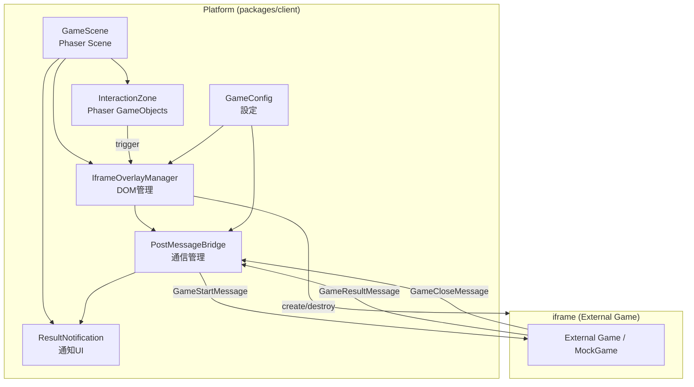
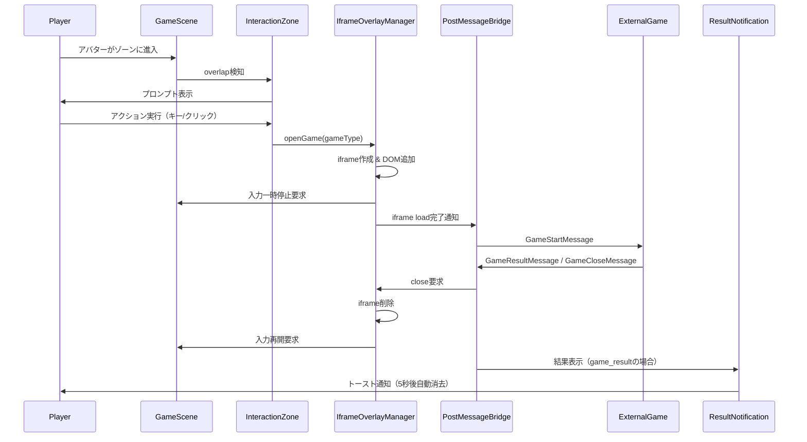

# Design Document: Game iframe Integration

## Overview

Phaser.js ベースの game-plaza-proto プラットフォーム上で、外部ゲームを iframe 経由で表示し postMessage で双方向通信を行う機能を設計する。プレイヤーがワールド内の特定エリアでゲーム開始をトリガーすると、Phaser キャンバスの上に iframe オーバーレイが表示され、外部ゲームとの通信が行われる。ゲーム完了後は iframe を閉じ、結果を通知表示する。

本設計はシングルプレイヤーフローのみを対象とし、モノレポ構成（`packages/client`, `packages/shared`）の既存アーキテクチャに沿って実装する。

## Architecture



### データフロー



## Components and Interfaces

### 1. PostMessageBridge (`packages/client/src/iframe/PostMessageBridge.ts`)

iframe との postMessage 通信を管理するクラス。

```typescript
interface PostMessageBridgeConfig {
  allowedOrigins: string[];
}

class PostMessageBridge {
  private config: PostMessageBridgeConfig;
  private iframeWindow: Window | null;
  private targetOrigin: string;
  private onResult: ((result: GameResultMessage) => void) | null;
  private onClose: (() => void) | null;
  private messageListener: ((event: MessageEvent) => void) | null;

  constructor(config: PostMessageBridgeConfig);

  /** iframe ウィンドウを設定し、message イベントリスナーを登録 */
  attach(iframeWindow: Window, targetOrigin: string): void;

  /** message イベントリスナーを解除し、参照をクリア */
  detach(): void;

  /** GameStartMessage を iframe に送信 */
  sendGameStart(message: GameStartMessage): void;

  /** 結果受信コールバックを設定 */
  onGameResult(callback: (result: GameResultMessage) => void): void;

  /** クローズ受信コールバックを設定 */
  onGameClose(callback: () => void): void;

  /** origin を検証する（内部メソッド） */
  private isAllowedOrigin(origin: string): boolean;

  /** 受信メッセージを検証・ルーティングする（内部メソッド） */
  private handleMessage(event: MessageEvent): void;
}
```

### 2. IframeOverlayManager (`packages/client/src/iframe/IframeOverlayManager.ts`)

iframe DOM 要素の作成・表示・削除を管理するクラス。

```typescript
interface IframeOverlayCallbacks {
  onInputPause: () => void;
  onInputResume: () => void;
}

class IframeOverlayManager {
  private containerEl: HTMLElement;
  private overlayEl: HTMLElement | null;
  private iframeEl: HTMLIFrameElement | null;
  private bridge: PostMessageBridge;
  private callbacks: IframeOverlayCallbacks;
  private loadTimeout: number | null;

  constructor(
    containerId: string,
    bridge: PostMessageBridge,
    callbacks: IframeOverlayCallbacks
  );

  /** ゲームを開く: iframe を作成しオーバーレイ表示 */
  open(url: string, targetOrigin: string): void;

  /** オーバーレイを閉じて DOM をクリーンアップ */
  close(): void;

  /** iframe がロード中かどうか */
  isOpen(): boolean;

  /** タイムアウト処理 */
  private startLoadTimeout(): void;
  private clearLoadTimeout(): void;
}
```

### 3. GameConfig (`packages/client/src/iframe/GameConfig.ts`)

ゲーム設定を管理するモジュール。

```typescript
interface GameEntry {
  url: string;
  origin: string;  // postMessage の targetOrigin
}

interface GameIframeConfig {
  games: Record<string, GameEntry>;  // key = gameType
  allowedOrigins: string[];
  loadTimeoutMs: number;  // デフォルト 10000
}

/** デフォルト設定（ローカル開発用） */
const DEFAULT_GAME_CONFIG: GameIframeConfig = {
  games: {
    mock: {
      url: '/mock-game.html',
      origin: window.location.origin,
    },
  },
  allowedOrigins: [window.location.origin],
  loadTimeoutMs: 10000,
};
```

### 4. InteractionZone (`packages/client/src/iframe/InteractionZone.ts`)

ワールド内のゲーム開始トリガーエリアを管理するクラス。

```typescript
interface InteractionZoneConfig {
  x: number;
  y: number;
  width: number;
  height: number;
  gameType: string;
  label: string;
}

class InteractionZone {
  private zone: Phaser.GameObjects.Zone;
  private visual: Phaser.GameObjects.Rectangle;
  private promptText: Phaser.GameObjects.Text | null;
  private isPlayerInZone: boolean;
  private config: InteractionZoneConfig;

  constructor(scene: Phaser.Scene, config: InteractionZoneConfig);

  /** プロンプト表示 */
  showPrompt(): void;

  /** プロンプト非表示 */
  hidePrompt(): void;

  /** ゾーン内かどうか */
  getIsPlayerInZone(): boolean;

  /** ゲームタイプを取得 */
  getGameType(): string;

  /** 破棄 */
  destroy(): void;
}
```

### 5. ResultNotification (`packages/client/src/iframe/ResultNotification.ts`)

トースト形式の結果通知 UI。

```typescript
class ResultNotification {
  private containerEl: HTMLElement;
  private currentToast: HTMLElement | null;
  private dismissTimer: number | null;

  constructor(containerId: string);

  /** 結果を表示（5秒後に自動消去） */
  show(result: GameResultMessage): void;

  /** 手動で消去 */
  dismiss(): void;
}
```

### 6. メッセージ型定義 (`packages/shared/src/iframe-messages.ts`)

プラットフォームと外部ゲーム間の postMessage インターフェース。

```typescript
/** プラットフォーム → 外部ゲーム */
interface GameStartMessage {
  type: 'game_start';
  gameType: string;
  players: GamePlayer[];
}

interface GamePlayer {
  userName: string;
  uuid: string;       // sessionId
  isLocal: boolean;
}

/** 外部ゲーム → プラットフォーム */
interface GameResultMessage {
  type: 'game_result';
  winnerId: string | null;  // null = draw
  scores?: Record<string, number>;
}

/** 外部ゲーム → プラットフォーム */
interface GameCloseMessage {
  type: 'game_close';
}

/** 全メッセージの Union 型 */
type IframeMessage = GameStartMessage | GameResultMessage | GameCloseMessage;
```

### 7. MockGame (`packages/client/public/mock-game.html`)

静的 HTML ファイル。Vite の public ディレクトリに配置し、開発サーバーで直接配信される。

- `postMessage` で `GameStartMessage` を受信して画面に表示
- 「ゲーム終了」ボタンで `GameResultMessage` を送信
- 「閉じる」ボタンで `GameCloseMessage` を送信

## Data Models

### メッセージバリデーション

受信メッセージの型ガード関数を `packages/shared` に配置し、プラットフォームとモックゲームの両方で利用する。

```typescript
function isGameStartMessage(data: unknown): data is GameStartMessage;
function isGameResultMessage(data: unknown): data is GameResultMessage;
function isGameCloseMessage(data: unknown): data is GameCloseMessage;
function isIframeMessage(data: unknown): data is IframeMessage;
```

### CSS オーバーレイ構造

```css
.iframe-overlay {
  position: absolute;
  top: 0;
  left: 0;
  width: 100%;
  height: 100%;
  z-index: 1000;
  background: rgba(0, 0, 0, 0.8);
  display: flex;
  justify-content: center;
  align-items: center;
}

.iframe-overlay__iframe {
  width: 100%;
  height: 100%;
  border: none;
}

.iframe-overlay__close-btn {
  position: absolute;
  top: 16px;
  right: 16px;
  z-index: 1001;
}
```

## Correctness Properties

*A property is a characteristic or behavior that should hold true across all valid executions of a system—essentially, a formal statement about what the system should do. Properties serve as the bridge between human-readable specifications and machine-verifiable correctness guarantees.*

### Property 1: Origin validation correctness

*For any* origin string and any allowed origins list, the PostMessageBridge SHALL process the message if and only if the origin is contained in the allowed origins list.

**Validates: Requirements 1.4, 1.6**

### Property 2: Unknown message type rejection

*For any* message object with a `type` field that is not one of "game_start", "game_result", or "game_close", the PostMessageBridge SHALL ignore the message (not trigger any result or close callback).

**Validates: Requirements 1.5**

### Property 3: GameStartMessage construction integrity

*For any* player information (userName, uuid, isLocal), the constructed GameStartMessage SHALL contain those exact values in the `players` array, preserving all fields without mutation.

**Validates: Requirements 3.4**

### Property 4: Message type guard round-trip consistency

*For any* valid IframeMessage object, serializing to JSON and then validating with the corresponding type guard function SHALL return true, and the deserialized object SHALL be equivalent to the original.

**Validates: Requirements 1.1, 1.2, 1.3**

## Error Handling

| シナリオ | 処理 |
|---------|------|
| iframe ロードタイムアウト（10秒） | オーバーレイを閉じ、エラー通知を表示 |
| 不正な origin からのメッセージ | メッセージを無視（ログ出力のみ） |
| 未知の message type | メッセージを無視、console.warn |
| GameConfig に存在しない gameType | エラー通知を表示、iframe を開かない |
| iframe 内でのランタイムエラー | 外部ゲーム側の責任。プラットフォームはタイムアウトで対応 |

## Testing Strategy

### テストフレームワーク

- **Unit / Property テスト**: vitest + fast-check（既存の vitest 環境を活用）
- **DOM テスト**: happy-dom（既存の devDependency）

### テストの分類

#### Property-Based Tests（fast-check）

correctness properties に基づく普遍的なテスト。各テスト最低100回のイテレーション。

- **Property 1**: origin 検証ロジック — 任意の origin とリストの組み合わせ
- **Property 2**: unknown type の拒否 — 任意の不正メッセージ
- **Property 3**: GameStartMessage の構成整合性 — 任意のプレイヤー情報
- **Property 4**: 型ガードの round-trip — 任意の有効メッセージ

タグフォーマット: `Feature: game-iframe-integration, Property N: {property_text}`

#### Unit Tests（vitest）

具体的なシナリオと境界条件のテスト。

- IframeOverlayManager: DOM の生成・削除、CSS の正確性
- InteractionZone: overlap 検知、プロンプトの表示/非表示
- ResultNotification: トースト表示、5秒タイマー
- PostMessageBridge: タイムアウト処理、attach/detach ライフサイクル
- GameConfig: 設定値の取得、存在しない gameType のエラー

#### Integration Tests

- 全体フロー: ゲーム開始 → iframe 表示 → メッセージ送受信 → 結果通知
- MockGame: postMessage 通信の動作確認（手動テスト補完）
