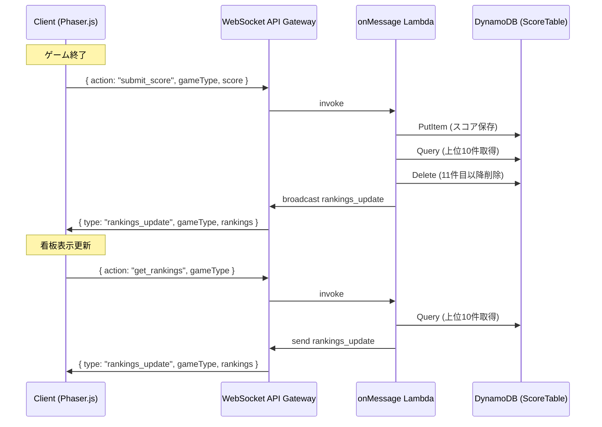

# Design Document: Scoreboard

## Overview

スコアボード機能は、ゲーム終了時のスコアをDynamoDBに保存し、ワールド内の各ゲームエリア横に看板（ランキング上位3名 + ゲーム説明ポップアップ）を表示する。既存のWebSocket通信基盤（onMessage Lambda）に新しいアクション（submit_score, get_rankings）を追加し、クライアント側はPhaser.jsでテキストオブジェクトとして看板を描画する。

### 設計方針

- 既存アーキテクチャを最大限活用（WebSocket通信、CDKスタック、sharedパッケージの型定義パターン）
- スコア保存は非同期で行い、ゲームプレイへの影響を最小限に抑える
- ランキングデータは全プレイヤーにブロードキャストし、看板をリアルタイム更新する

## Architecture



### レイヤー構成

1. **Shared層** (`packages/shared`): メッセージ型定義、バリデーション関数
2. **Server層** (`packages/server`): スコア保存・取得ロジック、ランキングブロードキャスト
3. **Client層** (`packages/client`): 看板表示、ポップアップUI、ランキング受信ハンドラ
4. **Infrastructure層** (`packages/cdk`): ScoreTable定義、Lambda環境変数設定

## Components and Interfaces

### 1. Shared パッケージ拡張

```typescript
// packages/shared/src/types.ts に追加

/** ランキング1件分のデータ */
export interface RankingEntry {
  playerName: string;
  score: number;
}

/** クライアント → サーバー メッセージ（追加分） */
export type ClientMessage =
  | { action: "init" }
  | { action: "move"; position: Position }
  | { action: "customize_avatar"; avatarData: AvatarData }
  | { action: "heartbeat" }
  | { action: "submit_score"; gameType: string; score: number }
  | { action: "get_rankings"; gameType: string };

/** サーバー → クライアント メッセージ（追加分） */
export type ServerMessage =
  | { type: "world_state"; players: PlayerInfo[] }
  | { type: "player_joined"; sessionId: string; avatar: AvatarData; position: Position }
  | { type: "player_left"; sessionId: string }
  | { type: "player_moved"; sessionId: string; position: Position }
  | { type: "avatar_updated"; sessionId: string; avatarData: AvatarData }
  | { type: "rankings_update"; gameType: string; rankings: RankingEntry[] };
```

### 2. Server - スコアDB操作モジュール

```typescript
// packages/server/src/scoreDb.ts

export interface ScoreRecord {
  gameType: string;       // PK
  sortKey: string;        // SK: "score#timestamp" (スコア降順ソート用にゼロパディング)
  playerName: string;
  score: number;
  timestamp: number;
}

/** スコアを保存する */
export async function saveScore(gameType: string, playerName: string, score: number): Promise<void>;

/** gameType のランキング上位N件を取得する */
export async function getTopScores(gameType: string, limit?: number): Promise<RankingEntry[]>;

/** 上位10件を超えるレコードを削除する */
export async function pruneScores(gameType: string): Promise<void>;
```

### 3. Server - onMessage Lambda ハンドラ拡張

```typescript
// packages/server/src/handlers/onMessage.ts に追加

async function handleSubmitScore(connectionId: string, gameType: unknown, score: unknown): Promise<void>;
async function handleGetRankings(connectionId: string, gameType: unknown): Promise<void>;
```

### 4. Client - Signboard クラス

```typescript
// packages/client/src/scenes/Signboard.ts

export class Signboard {
  constructor(scene: Phaser.Scene, config: SignboardConfig);

  /** ランキングデータを更新する */
  updateRankings(rankings: RankingEntry[]): void;

  /** ポップアップ表示/非表示 */
  showPopup(): void;
  hidePopup(): void;
}

export interface SignboardConfig {
  x: number;
  y: number;
  gameType: string;
  gameName: string;
  description: string;
}
```

### 5. Client - Rankings ハンドラ

```typescript
// packages/client/src/handlers/RankingsHandler.ts

export class RankingsHandler {
  constructor(networkManager: NetworkManager, signboards: Map<string, Signboard>);

  /** rankings_update メッセージを処理する */
  handleRankingsUpdate(message: RankingsUpdateMessage): void;

  /** 全ゲームタイプのランキングを要求する */
  requestAllRankings(): void;
}
```

## Data Models

### ScoreTable (DynamoDB)

| Attribute | Type | Description |
|-----------|------|-------------|
| gameType (PK) | String | ゲーム種別識別子 |
| sortKey (SK) | String | `{paddedScore}#{timestamp}` 形式（降順クエリ用） |
| playerName | String | プレイヤーのニックネーム |
| score | Number | スコア値 |
| timestamp | Number | Unix timestamp (ms) |

**Sort Key設計:**
- スコアを降順で取得するため、`(MAX_SCORE - score)` をゼロパディングした文字列をSort Keyのプレフィックスに使用
- 例: スコア85 → `"0000000915#1700000000000"` (MAX_SCORE=1000として)
- これにより `ScanIndexForward: true` でも高スコア順に取得可能

**保持件数制限:**
- 各gameTypeにつき上位10件のみ保持
- 新スコア保存時に11件目以降を自動削除（prune処理）

### メッセージフォーマット

**ClientMessage - submit_score:**
```json
{ "action": "submit_score", "gameType": "breakout", "score": 150 }
```

**ClientMessage - get_rankings:**
```json
{ "action": "get_rankings", "gameType": "breakout" }
```

**ServerMessage - rankings_update:**
```json
{
  "type": "rankings_update",
  "gameType": "breakout",
  "rankings": [
    { "playerName": "Player_ABC", "score": 200 },
    { "playerName": "Player_XYZ", "score": 150 },
    { "playerName": "Player_123", "score": 100 }
  ]
}
```

## Correctness Properties

*A property is a characteristic or behavior that should hold true across all valid executions of a system — essentially, a formal statement about what the system should do. Properties serve as the bridge between human-readable specifications and machine-verifiable correctness guarantees.*

### Property 1: メッセージシリアライゼーションのラウンドトリップ

*For any* valid submit_score, get_rankings, or rankings_update message, serializing then deserializing SHALL produce an equivalent message object.

**Validates: Requirements 7.1, 7.2, 7.3, 7.4**

### Property 2: 無効メッセージの拒否

*For any* submit_score message with a non-string gameType, empty gameType, non-numeric score, or negative score, the validation function SHALL return false.

**Validates: Requirements 1.3**

### Property 3: ランキングの順序性と上限

*For any* set of score records for a given gameType, the returned rankings SHALL be sorted in descending order by score and limited to at most 10 entries.

**Validates: Requirements 2.1, 2.2, 3.3**

### Property 4: 看板フォーマット文字列

*For any* array of RankingEntry objects (1〜3件), the formatted signboard text SHALL contain each entry in "N位: PlayerName Xpts" format, with entries ordered by rank (1位, 2位, 3位).

**Validates: Requirements 4.2**

### Property 5: 近接検出の正確性

*For any* player position and signboard position, the proximity detection function SHALL return true if and only if the Euclidean distance is within the defined threshold.

**Validates: Requirements 5.1, 5.2**

## Error Handling

| シナリオ | 対応 |
|---------|------|
| submit_score の gameType が不正 | メッセージを無視し、statusCode 200 を返す |
| submit_score の score が非数値/負数 | メッセージを無視し、statusCode 200 を返す |
| get_rankings の gameType が不正 | メッセージを無視し、statusCode 200 を返す |
| DynamoDB書き込み失敗 | エラーログ出力、statusCode 500 を返す |
| DynamoDB読み取り失敗 | エラーログ出力、空のランキングを返す |
| ブロードキャスト時にGoneException | 既存のbroadcast.tsの仕組みで自動クリーンアップ |
| クライアントがrankings_updateを受信時にSignboardが未初期化 | データをバッファリングし、Signboard初期化後に適用 |

## Testing Strategy

### Property-Based Testing

property-based testingライブラリ: **fast-check**（既存プロジェクトがTypeScript + vitestを使用しているため）

各プロパティテストは最低100イテレーション実行する。

テスト対象:
- メッセージのシリアライゼーション/デシリアライゼーション（Property 1）
- メッセージバリデーション（Property 2）
- ランキングソート・上限ロジック（Property 3）
- 看板フォーマット関数（Property 4）
- 近接検出関数（Property 5）

### Unit Testing

- onMessage Lambda のハンドラ分岐テスト
- ScoreDb モジュールの個別関数テスト（DynamoDB モック使用）
- Signboard クラスの表示ロジックテスト

### Integration Testing

- submit_score → DynamoDB保存 → rankings_update ブロードキャストの一連フロー
- CDKスナップショットテスト（ScoreTable定義、Lambda環境変数）
